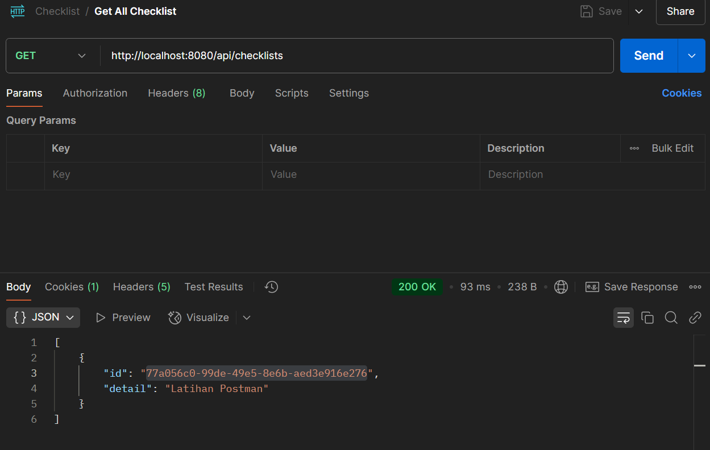
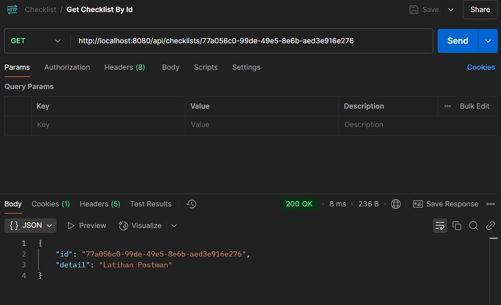
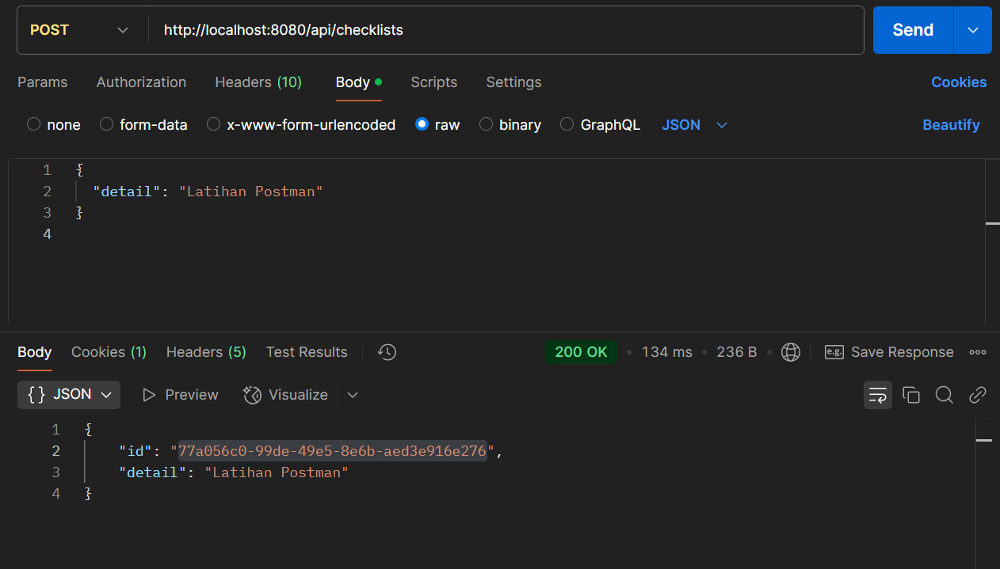
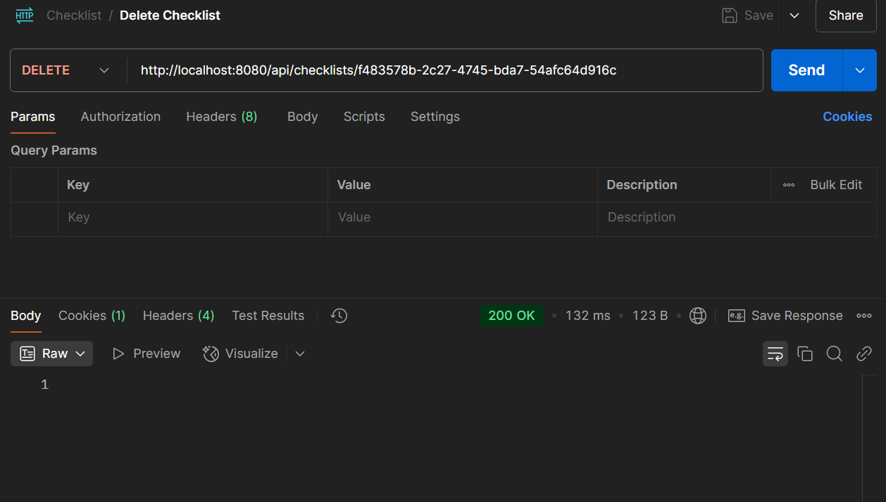
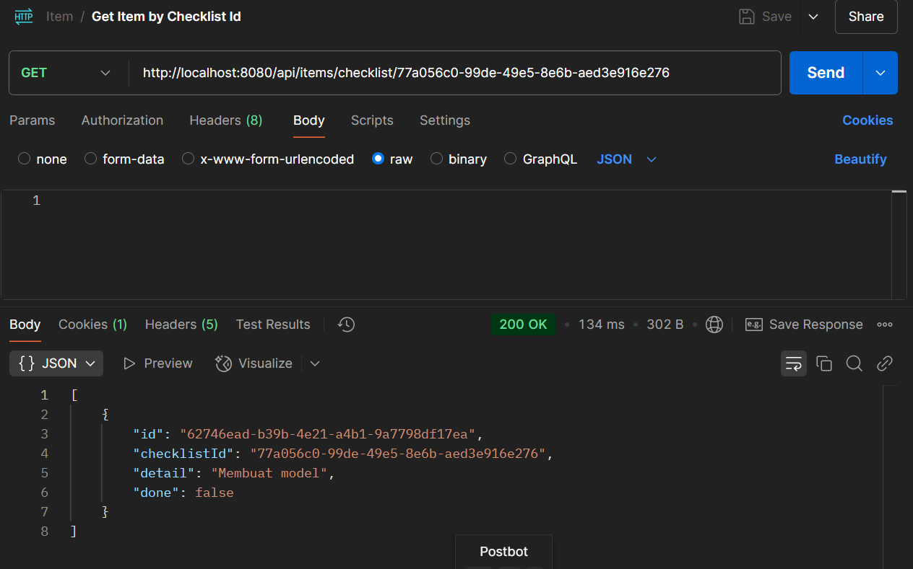
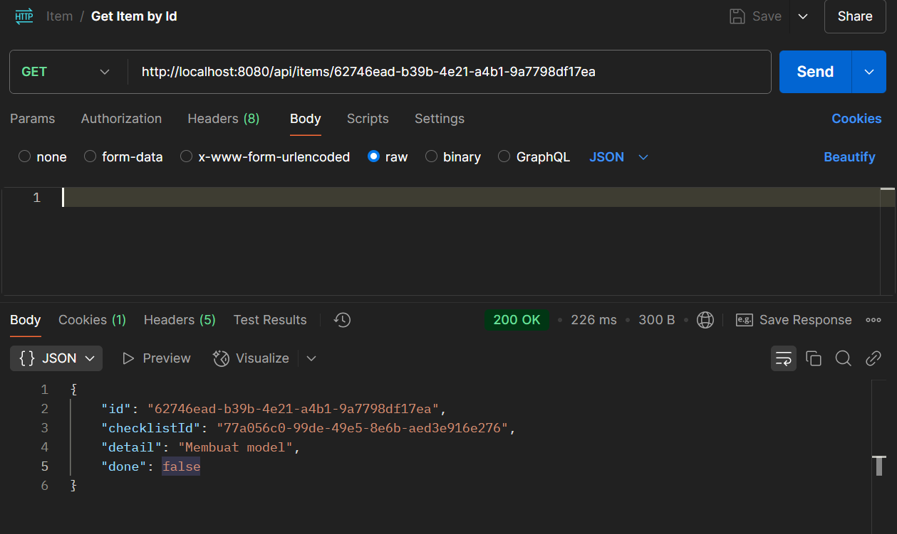
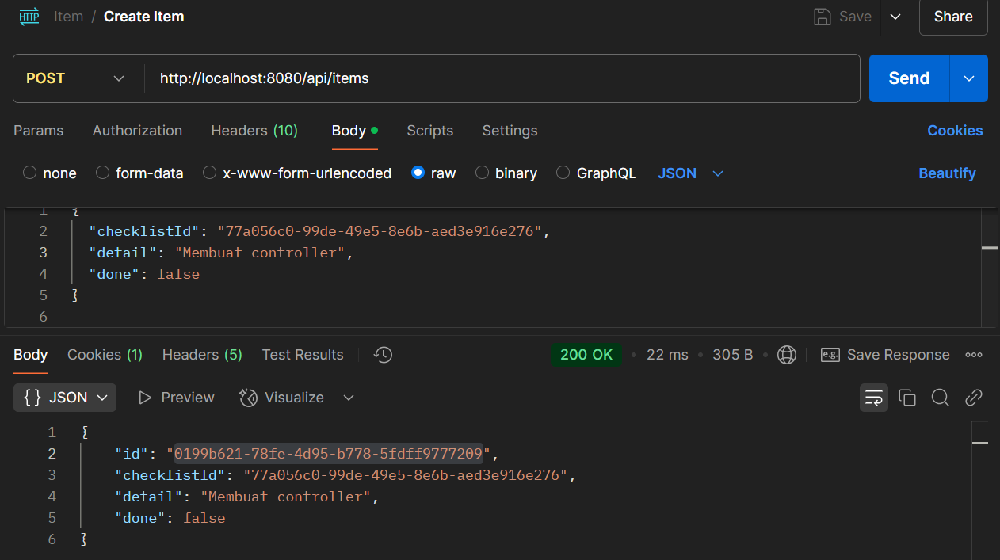
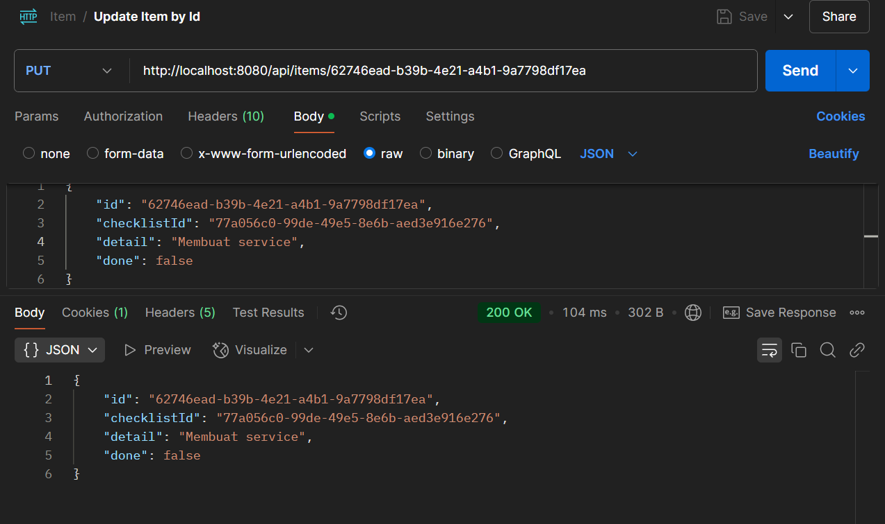
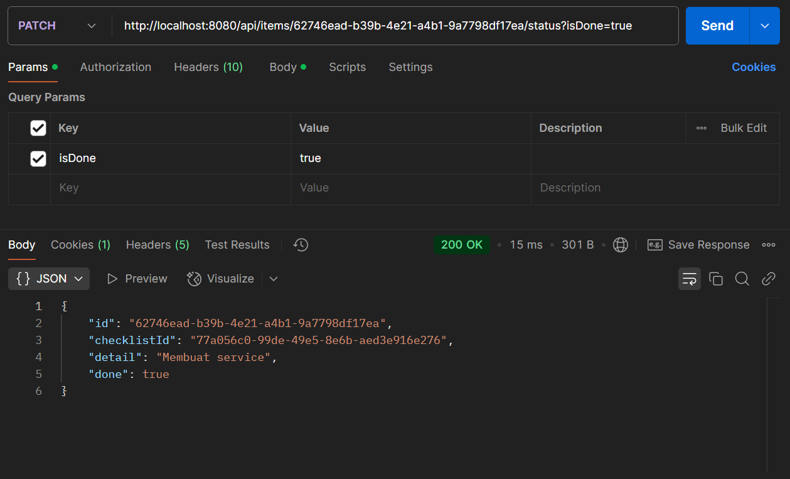
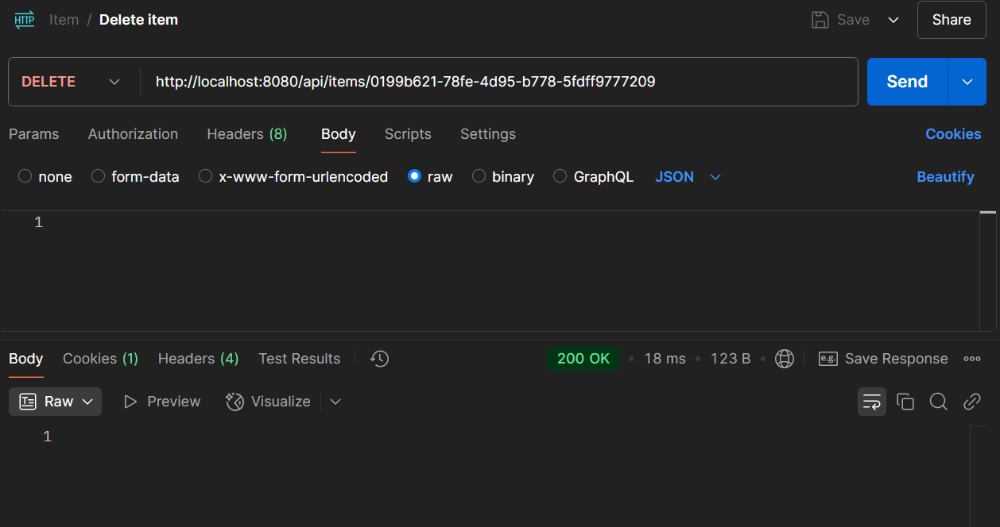

## To Do List App

### Overview
This project is a simple web application built using Spring Boot for managing a to-do list. It provides CRUD functionalities (Create, Read, Update, Delete) for checklists and their associated items, utilizing a PostgreSQL database.

### Technologies Used
- Spring Boot: Framework for creating and running Spring-based applications.
- PostgreSQL: Open-source relational database management system.

### Features
- Manage Checklists: Create, view, and delete checklists.
- Manage Items: Add, update, mark as done, or remove items within a checklist.
- Retrieve Data: Get checklists and items via API endpoints.

### Project Structure
```cmd
├───main
│   ├───java
│   │   └───com
│   │       └───bts
│   │           └───ToDoList
│   │               │   ToDoListApplication.java
│   │               │
│   │               ├───auth
│   │               ├───controllers
│   │               │       ChecklistController.java
│   │               │       ItemController.java
│   │               │
│   │               ├───data
│   │               │   ├───models
│   │               │   │       Checklist.java
│   │               │   │       Item.java
│   │               │   │       User.java
│   │               │   │
│   │               │   └───repository
│   │               │           ChecklistRepository.java
│   │               │           ItemRepository.java
│   │               │
│   │               └───service
│   │                       ChecklistService.java
│   │                       ItemService.java
│   │
│   └───resources
│       │   application.properties
│       │
│       ├───static
│       └───templates
└───test
    └───java
        └───com
            └───bts
                └───ToDoList
                        ToDoListApplicationTests.java
```

### Running the Application
1. Create PostgreSQL database named todolist, configure the username and password in the `application.properties`
2. Execute `mvn spring-boot:run` in the project directory
3. The application will be accessible at `http://localhost:8080`

### API List
1. Checklist APIs
- GET	/api/checklists: 	Get all checklists

- GET	/api/checklists/{id}	Get checklist by ID

- POST	/api/checklists	Create a new checklist

- DELETE	/api/checklists/{id}	Delete a checklist by ID

- 
2. Item APIs
- GET	/api/items/checklist/{checklistId}	Get all items in a checklist

- GET	/api/items/{id}	Get item by ID

- POST	/api/items	Create a new item

- PUT	/api/items/{id}	Update an item

- PATCH	/api/items/{id}/status?isDone=true	Mark an item as done

- DELETE	/api/items/{id}	Delete an item by ID


3. User APIs